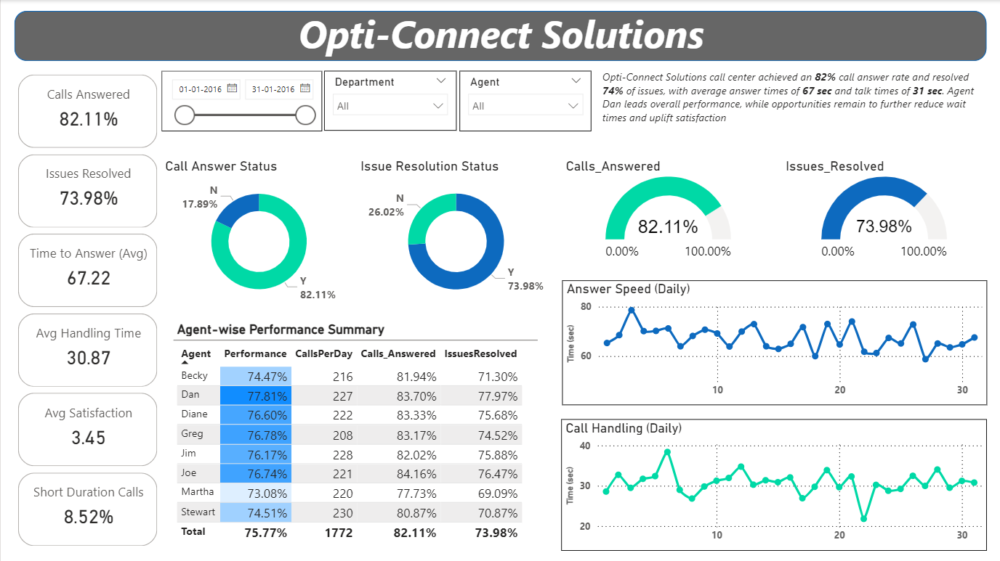

# 📊 OptiConnect Call Center Dashboard – Power BI

This Power BI project analyzes call center performance metrics for a fictional company, **OptiConnect Solutions**, with the goal of improving agent productivity and customer satisfaction.

---

## 🎯 Objective

To create an interactive dashboard that answers:
- Are calls being answered in a timely manner?
- Are customer issues being resolved efficiently?
- How do talk time and speed of answer impact satisfaction?
- Which departments and agents are performing best?

---

## 📁 Dataset Summary

| Column                | Description                             |
|-----------------------|-----------------------------------------|
| Call ID              | Unique call identifier                  |
| Date                 | Date of the call                        |
| Agent Name           | Name of the handling agent              |
| Department           | Customer support department             |
| Answered (Y/N)       | Whether the call was answered           |
| Resolved (Y/N)       | Whether the issue was resolved          |
| Speed of Answer      | Time taken to answer (in seconds)       |
| Avg Talk Duration    | Duration of the call (in seconds)       |
| Satisfaction Rating  | Customer feedback score (1 to 5)        |

---

## 📊 Dashboard Features

- 📌 **KPI Cards**: Answer Rate, Resolution %, Avg Speed to Answer, Avg Talk Duration, Avg Satisfaction
- 📈 **Line Charts**: Daily trends of speed to answer and call handling time
- 🧑‍💼 **Agent-Level Table**: Performance %, Calls per Day, Answered %, Resolved %
- 🥧 **Donut Charts**:
  - **Answered vs Not Answered**
  - **Resolved vs Not Resolved**
- 📋 **Interactive Filters**: Date, Agent, Department

---

## 📍 Tools Used

- **Power BI** – Visualizations and dashboard creation  
- **DAX** – Measures and KPIs  
- **Power Query** – Data cleaning and transformation  
- **Excel** – Dataset source

---

## 🧮 Sample DAX Measures

```DAX
Answered Calls = CALCULATE(COUNT('Calls'[Call ID]), 'Calls'[Answered] = "Y")

Answer Rate = DIVIDE([Answered Calls], COUNT('Calls'[Call ID]))

Resolved Calls = CALCULATE(COUNT('Calls'[Call ID]), 'Calls'[Resolved] = "Y")

Avg Speed of Answer = AVERAGE('Calls'[Speed of Answer])

Avg Talk Duration = AVERAGE('Calls'[Avg Talk Duration])
```

## 📈 Insights Discovered

- 82% of calls were answered, and 74% of issues were resolved
- Agent Dan led in performance; others had improvement areas
- Short talk durations did not always mean high satisfaction
- Peak delay times were visible in daily trend lines

## 📊 Power BI Dashboard Preview

Here’s a snapshot of the interactive dashboard created in Power BI:



## 🧠 Learning Outcome

This project helped me apply DAX, Power Query, and dashboard design to solve a real-world business case using a data-driven approach. 
I practiced turning KPIs into visuals and presenting performance insights clearly for business decisions.

## 🙋 Author

Jaykumar Tamkhane
- 📧 Email: jaytamkhane161@gmail.com
- 🔗 LinkedIn: linkedin.com/in/jaytamkhane
